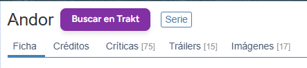

# Film2Trakt

## Welcome to Film2Trakt! 👋

Welcome to the official repository for **Film2Trakt**, an open-source browser extension designed to bridge the gap between FilmAffinity and Trakt websites. We're excited to have you here! Whether you're a user, a developer, or just curious, we appreciate your interest in this project.

As an open-source initiative, we believe in collaboration and community. Your feedback, bug reports, and contributions are highly valued and essential for making Film2Trakt better for everyone. Please feel free to explore the project, check out the code, read the documentation, and join us in improving the user experience for film and series enthusiasts.

Thank you for being part of our community!

## Overview

Film2Trakt is a Chrome extension designed to **streamline your movie and series tracking workflow** by intelligently connecting [FilmAffinity](https://www.filmaffinity.com/) with [Trakt](https://trakt.tv/). Tired of copying and pasting titles? With Film2Trakt, you can instantly search for any title from FilmAffinity on Trakt with a single click, saving you time and effort. It's the perfect tool for film and series enthusiasts who use both platforms.

For a more detailed description of the project's vision and objectives, please refer to [Project Overview](./docs/01_project_overview.md).

## Features ✨

- 🖱️ **One-Click Trakt Search:** Adds an intuitive button on FilmAffinity pages that takes you directly to the search results on Trakt.
- 🔍 **Intelligent Title Extraction:** Automatically captures the exact movie or series title from the FilmAffinity page.
- 🎬 **Automatic Detection (Series/Movie):** Identifies if the content is a movie or a series to direct the search to the correct section on Trakt.
- 👌 **User-Friendly Interface:** A stylish and clearly visible button that integrates natively into the FilmAffinity design.
- ⚠️ **Basic Error Handling:** Alerts the user if there are issues extracting the title.
- 🌍 **Internationalization (i18n) Ready:** Prepared for multiple languages. Currently supports **Spanish (`es`)** for all UI elements and messages.

For a complete and detailed list of features, including edge cases and error handling, please refer to [Features](./docs/03_features.md). For functional and non-functional requirements, check [Requirements](./docs/02_requirements.md).

## Installation 🚀

You can install Film2Trakt in several ways:

1.  **From GitHub Releases (Recommended for users):**

    - Go to the [Releases page](https://github.com/seyerjo/fa2trakt/releases/latest).
    - Download the `.zip` file of the latest version.
    - Unzip the file into a folder on your computer.
    - Open Chrome and navigate to `chrome://extensions`.
    - Enable "Developer mode" in the top right corner.
    - Click "Load unpacked" and select the folder where you unzipped the files.
    - The Film2Trakt extension is now installed and active.

2.  **Loading from Source Code (For developers):**
    - Clone this repository or download the files.
    - Open Chrome and navigate to `chrome://extensions`.
    - Enable "Developer mode".
    - Click "Load unpacked" and select the root folder of the repository (where `manifest.json` is located).

For more detailed development environment setup instructions and prerequisites, please refer to [Setup and Installation.md](./docs/07_setup_and_installation.md).

## Usage 🎬

Using Film2Trakt is very simple:

1.  Navigate to a movie or series page on the **Spanish version** of FilmAffinity (for example, `https://www.filmaffinity.com/es/filmXXXXXX.html`).
    - **Note:** Currently, the extension only activates on the Spanish site (`/es/`).
2.  You will see a button with the text "Buscar en Trakt" (or similar, depending on the language) next to the main title of the movie or series on the page.

    
    Image of the button for the Spanish version

3.  Click the button. A new tab will open, displaying the search results for that title on Trakt.tv.

For a more complete step-by-step usage guide and basic troubleshooting, please refer to [Usage Guide](docs/08_usage_guide.md).

## Technologies Used 💻

Film2Trakt is built using the following technologies:

- **JavaScript:** For the main extension logic, title extraction, and interaction with the FilmAffinity DOM.
- **CSS:** For styling the button and ensuring its visual integration with FilmAffinity.
- **Chrome Extension API:** For extension functionality, permissions, and tab handling.
- **Chrome Extension i18n API:** For managing internationalization of texts.

For a more detailed justification of the choice of these technologies, you can consult [Tech Stack](docs/05_tech-stack.md).

## Project Documentation 📚

This project is thoroughly documented to provide a complete understanding of its architecture, features, and implementation. Whether you are a user, developer, or just curious, we invite you to explore our knowledge hub.

For a complete index of all documentation, please refer to the [Documentation Index](./docs/00_documentation_index.md).

## Contributing 👋

Contributions are welcome! If you find a bug, have a suggestion for improvement, or want to add a new feature, please don't hesitate to participate.

- **Report Bugs or Suggest Enhancements:** Open an [Issue on GitHub](https://github.com/seyerjo/fa2trakt/issues). Please describe the problem or suggestion with as much detail as possible.
- **Contribute Code:** If you want to submit code, please follow our contribution process. This generally involves forking the repository, creating a branch, implementing your changes, and submitting a Pull Request.

For detailed guidelines on how to contribute, setting up the development environment for collaboration, and the Pull Request process, please refer to [Contribution Guidelines](./CONTRIBUTION_GUIDELINES.md).

## Known Issues 🐛

- The extension's functionality is dependent on the HTML structure of FilmAffinity. Significant changes to the FilmAffinity website could impact title extraction and button placement.

## Future Enhancements 💡

Here are some of the key improvements we're planning:

**Short-term (v1.x):**

- **Improved Error Handling:** Replace intrusive alerts with subtle UI notifications and make title extraction more robust.
- **Broader FilmAffinity Support:** Add support for other languages on FilmAffinity, like English (`/en/`).
- **Code Quality:** Integrate tools like ESLint to ensure code consistency and quality.

**Medium & Long-term (v2.0 and beyond):**

- **Direct Trakt API Integration:**

  - Authenticate with your Trakt account.
  - Add movies/shows to your watchlist or collection directly from FilmAffinity.
  - See the watched status of an item without leaving the page.

- **UI/UX Improvements:**

  - A dedicated options page to configure the extension.
  - Keyboard shortcuts for quick searching.
  - Integration with Chrome's right-click context menu.

- **Performance & Security:** Continuously optimize performance and strengthen the extension's security policies.

## Changelog 📜

Please refer to the [CHANGELOG](./CHANGELOG.md) file for the complete history of project changes and versions.

## License 📄

This project is licensed under the Apache License 2.0. See the [LICENSE](./LICENSE) file for more details.

## Support / Help 🙌

If you have questions, encounter problems, or need help, please open an [Issue on GitHub](https://github.com/seyerjo/fa2trakt/issues).

---

Thank you for using Film2Trakt!
