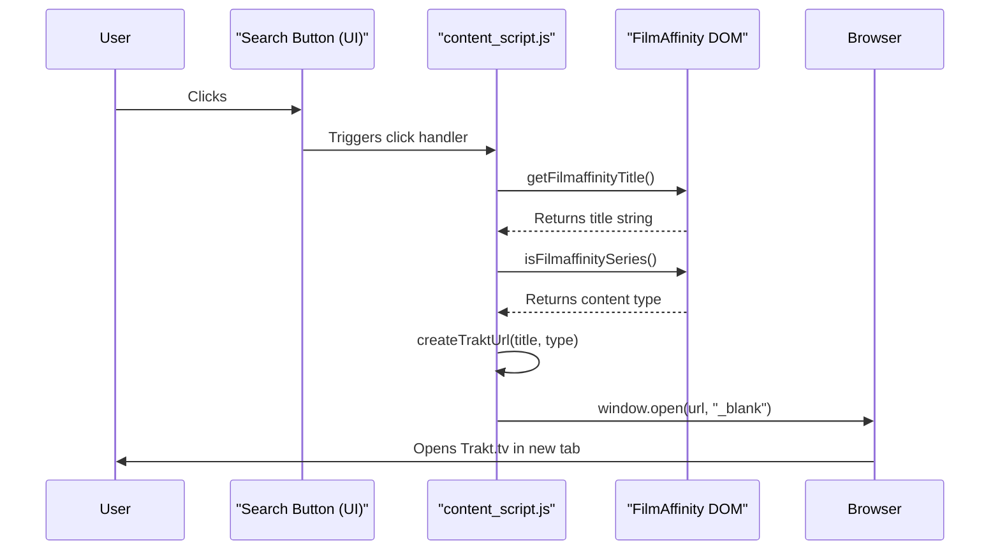

# Project Structure: Film2Trakt

This document details the architecture and structure of the Film2Trakt Chrome extension.

## 1. Architectural Overview

- **Architectural Style:** The extension follows a **Resilient Event-Driven Content Script** architecture, with these key characteristics:

  - Centralized DOM selectors for maintainability
  - Comprehensive error handling with localized messages
  - Performance-optimized DOM interactions
  - Prepared for future API integration

- **Key Architectural Patterns:**
  - **Content Script Injection:** Core logic (`content_script.js`) is injected directly into matching FilmAffinity pages.
  - **DOM Resilience:** Uses centralized selectors and fallback mechanisms to handle site structure changes.
  - **Error Containment:** Isolated error handling per feature with console logging and user notifications.
  - **Internationalization:** Full i18n support with Spanish as default locale.
  - **Progressive Enhancement:** Core features work without external dependencies.

## 2. Core Components

- **`src/manifest.json` (Configuration & Definition):**

  - **Responsibility:** Now located in src directory. Defines extension metadata and configuration.

- **`src/styles/main.css` (Presentation Layer):**

  - **Responsibility:** Moved to src/styles. Styles UI elements.

- **`src/_locales/` (Internationalization Resources):**
  - **Responsibility:** Located in src/\_locales. Contains Spanish translations.
- **Chrome Extension APIs (Browser Interaction Layer):**
  - **Responsibility:** These are the browser-provided APIs used by `content_script.js` to interact with the browser environment beyond the page's DOM.
  - **Key APIs Used:**
    - `chrome.i18n.getMessage()`: Retrieves localized strings.
    - (Implicitly) `chrome.runtime`: Provides context about the extension environment.

## 3. Communication and Interconnection

- **Internal (`content_script.js`):** Communication within the script occurs through standard JavaScript function calls.
- **Content Script <-> Web Page:** `content_script.js` interacts with the FilmAffinity page by directly manipulating its DOM using standard Web APIs (e.g., `document.querySelector`, `document.createElement`, `element.appendChild`, `element.addEventListener`).
- **Content Script <-> Browser APIs:** `content_script.js` calls Chrome Extension APIs (e.g., `chrome.tabs.create`, `chrome.i18n.getMessage`) to leverage browser functionality. These are asynchronous calls managed by the browser's event loop.
- **Data Formats:** Primarily involves passing JavaScript strings (titles, URLs) and primitive types between functions. Chrome API calls adhere to their specific expected argument types.
- **Authentication/Authorization:** Not applicable for the current architecture, as there's no inter-component communication requiring authentication beyond the browser's inherent extension permissions model.

## 4. Database Structure

- **Not Applicable:** The current version of Film2Trakt does not utilize any database or persistent storage mechanism (like `chrome.storage`). All state is transient and managed within the execution context of the content script on the page.

## 5. Data Flow (Typical Use Case: User Clicks "Search on Trakt")

1.  **User Action:** User clicks the injected "Search on Trakt" button on a FilmAffinity page.
2.  **Event Trigger (`content_script.js`):** The `click` event listener attached to the button executes its handler function.
3.  **Title Extraction (`content_script.js`):** The handler calls `getFilmaffinityTitle()`, which queries the DOM to find and retrieve the movie/series title string.
4.  **Type Detection (`content_script.js`):** The handler calls `isFilmaffinitySeries()`, which analyzes the DOM structure to determine if the content is a movie or series (returns boolean/string indicator).
5.  **URL Construction (`content_script.js`):** The handler calls `createTraktUrl()`, passing the title and type. This function constructs the appropriate Trakt search URL string.
6.  **Open Tab Request (`content_script.js` -> Browser):** The handler calls `openTraktUrl()`, which in turn calls `window.open(constructedUrl, "_blank")`.
7.  **Browser Action:** The browser opens the provided URL in a new tab.
8.  **Error Handling:** At each step (extraction, construction, opening), if an error occurs, localized messages are logged to the console, and potentially an alert is shown to the user (specifically if tab opening fails).

_Data Flow Diagram (Typical Use Case: User Clicks "Search on Trakt")_

## 6. Technology Stack

- **Core Language:** JavaScript (ES6+)
- **Styling:** CSS3
- **Markup (Implicit):** HTML (via DOM manipulation)
- **Environment:** Google Chrome Browser Extension Runtime
- **Key APIs:**
  - Chrome Extension APIs (`chrome.i18n`, `chrome.tabs`)
  - Web APIs (DOM Manipulation, Event Listeners)
- **Frameworks/Libraries:** None (uses vanilla JavaScript and standard Web/Chrome APIs)
- **Internationalization:** Chrome `i18n` subsystem
