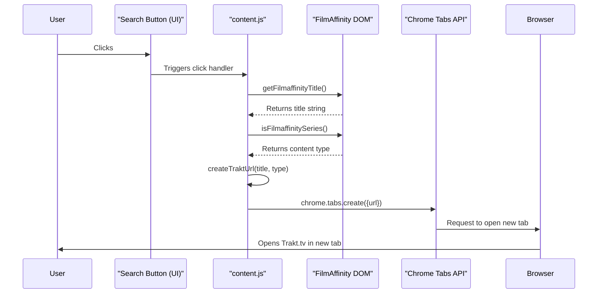

# Project Structure: Film2Trakt

This document details the architecture and structure of the Film2Trakt Chrome extension for the development team.

## 1. Architectural Overview

- **Architectural Style:** The extension follows a simple **Event-Driven Content Script** architecture, typical for Chrome extensions performing actions within specific web pages. It does not employ complex backend patterns like Microservices or layered monoliths.
- **Key Architectural Patterns:**
  - **Content Script Injection:** Core logic (`content.js`) is injected directly into matching FilmAffinity pages as defined in the `manifest.json`.
  - **DOM Manipulation:** The content script interacts with the FilmAffinity page's Document Object Model (DOM) to extract information (titles) and inject UI elements (the search button).
  - **Event Handling:** User interactions (button clicks) are handled via standard browser event listeners.
  - **Asynchronous Operations:** Interactions with Chrome APIs (like opening tabs) are asynchronous.
  - **Internationalization (i18n):** User-facing strings are managed using Chrome's `i18n` API and locale files.

## 2. Core Components

- **`manifest.json` (Configuration & Definition):**
  - **Responsibility:** Defines the extension's metadata (name, version, description), permissions (`activeTab`), icons, content scripts to be injected, target pages (`matches`), CSS files, and internationalization settings (default locale). Acts as the entry point and configuration hub for the browser.
- **`content.js` (Core Logic & UI Interaction):**
  - **Responsibility:** This is the main script executed within the context of FilmAffinity pages. It handles:
    - Extracting the movie/series title from the DOM.
    - Determining if the content is a movie or a series.
    - Creating and injecting the "Search on Trakt" button into the page DOM.
    - Handling click events on the injected button.
    - Constructing the appropriate Trakt.tv search URL.
    - Requesting the browser to open the URL in a new tab via Chrome APIs.
    - Handling errors and logging using localized messages.
- **`styles/main.css` (Presentation Layer):**
  - **Responsibility:** Provides the visual styling for the UI elements injected by `content.js` (specifically, the `.trakt-search-button`). Ensures consistent appearance and responsiveness.
- **`_locales/` (Internationalization Resources):**
  - **Responsibility:** Contains subdirectories for each supported language (currently `es` for Spanish). Each subdirectory holds a `messages.json` file defining key-value pairs for localized strings used in the UI and error messages.
- **Chrome Extension APIs (Browser Interaction Layer):**
  - **Responsibility:** These are the browser-provided APIs used by `content.js` to interact with the browser environment beyond the page's DOM.
  - **Key APIs Used:**
    - `chrome.i18n.getMessage()`: Retrieves localized strings.
    - `chrome.tabs.create()`: Opens a new browser tab.
    - (Implicitly) `chrome.runtime`: Provides context about the extension environment.

## 3. Communication and Interconnection

- **Internal (`content.js`):** Communication within the script occurs through standard JavaScript function calls.
- **Content Script <-> Web Page:** `content.js` interacts with the FilmAffinity page by directly manipulating its DOM using standard Web APIs (e.g., `document.querySelector`, `document.createElement`, `element.appendChild`, `element.addEventListener`).
- **Content Script <-> Browser APIs:** `content.js` calls Chrome Extension APIs (e.g., `chrome.tabs.create`, `chrome.i18n.getMessage`) to leverage browser functionality. These are asynchronous calls managed by the browser's event loop.
- **Data Formats:** Primarily involves passing JavaScript strings (titles, URLs) and primitive types between functions. Chrome API calls adhere to their specific expected argument types.
- **Authentication/Authorization:** Not applicable for the current architecture, as there's no inter-component communication requiring authentication beyond the browser's inherent extension permissions model.

## 4. Database Structure

- **Not Applicable:** The current version of Film2Trakt does not utilize any database or persistent storage mechanism (like `chrome.storage`). All state is transient and managed within the execution context of the content script on the page.

## 5. Data Flow (Typical Use Case: User Clicks "Search on Trakt")

1.  **User Action:** User clicks the injected "Search on Trakt" button on a FilmAffinity page.
2.  **Event Trigger (`content.js`):** The `click` event listener attached to the button executes its handler function.
3.  **Title Extraction (`content.js`):** The handler calls `getFilmaffinityTitle()`, which queries the DOM to find and retrieve the movie/series title string.
4.  **Type Detection (`content.js`):** The handler calls `isFilmaffinitySeries()`, which analyzes the DOM structure to determine if the content is a movie or series (returns boolean/string indicator).
5.  **URL Construction (`content.js`):** The handler calls `createTraktUrl()`, passing the title and type. This function constructs the appropriate Trakt.tv search URL string.
6.  **Open Tab Request (`content.js` -> Browser API):** The handler calls `openTraktUrl()`, which in turn calls `chrome.tabs.create({ url: constructedUrl })`.
7.  **Browser Action:** The Chrome browser receives the API request and opens the provided URL in a new tab.
8.  **Error Handling:** At each step (extraction, construction, opening), if an error occurs, localized messages are logged to the console, and potentially an alert is shown to the user (specifically for tab opening failure).

_Diagram Recommendation: A simple sequence diagram could visually represent this flow._

## 6. Technology Stack

- **Core Language:** JavaScript (ES6+)
- **Styling:** CSS3
- **Markup (Implicit):** HTML (via DOM manipulation)
- **Environment:** Google Chrome Browser Extension Runtime
- **Key APIs:**
  - Chrome Extension APIs (`chrome.i18n`, `chrome.tabs`)
  - Web APIs (DOM Manipulation, Event Listeners)
- **Frameworks/Libraries:** None (uses vanilla JavaScript and standard Web/Chrome APIs)
- **Internationalization:** Chrome `i18n` subsystem
